# About

Iniciando estudo em Angular!

# O que é Angular

- Framework Web
- Mantido pela equipe do Google
- Plataforma sólida para construir apps frontend robustos, eficientes e escaláveis
- Programação Orientada a Objetos

# Requisitos

- Node JS [v^18.19.1 ou mais recente](https://angular.dev/reference/versions)

```bash
npm install -g @angular/cli
```

- Trabalharemos com a versão 18+ do framework

# Estrutura básica do projeto

## EditorConfig

Configurações da IDE, nada específico do Angular, vem com configs defaults e só.

## Angular.json

Contém configurações do nosso aplicativo angular, do projeto. Essas configs são:

- Do build
- Otimizações de código que podem ser feitas, 
- Configuração para iniciar o projeto angular ao iniciar o servidor,
- Configurações de teste (quais arquivos ignorar/olhar), 
- Qual a configuração do typescript, etc.

Essas configurações serão levadas em consideração quando formos realizar a build, ou rodar o servidor/testes unitários.

## Package.json

Arquivos específicos do node (npm). Terá as dependências e scripts que nosso projeto está utilizando, seja para rodar comandos, start, build, testes, etc.

## Package-lock 

Informação bem certinhas de todas as versões instaladas (que estão dentro de node_modules).

## Tsconfig.json

Arquivo que realiza a configuração global do typescript (aplica a todo o projeto), configurações para compilação/otimização.

## Tsconfig.app.json

Configuração do typescript especificas para o projeto (quando estivermos rodando ele).

## Tsconfig.app.json

Configuração do typescript que serão aplicadas quando rodarmos os testes unitários.

## Pasta public

Terá basicamente imagens e assets estáticos da nossa aplicação.

## Pasta src (código-fonte)

### Style.css

Aqui já sabemos, estilização global do projeto.

### Main.ts

Entrypoint da aplicação angular, ela fará o "bootstrap" do programa, o pontapé inicial, passando qual componente será invocado seguido de duas configurações.

### index.html

Arquivo renderizado para o usuário ao acessar a página.

Dentro dele, ele irá invocar um componente chamado "app-root", que é o primeiro componente da nossa aplicação Angular.

O app-root por sua vez ao ser invocado, chamará os outros componentes, montando a página para o usuário.

**❗Lembre-se:** estamos utilizando um método SPA (single page application). Ou seja, para o navegador, ele só vai criar uma única página! Entretanto, todas as navegações
que serão feitas pelo usuário dentro do app, não sairão do index.html, para o navegador ficará sempre na mesma página.

Quem vai fazer a lógica para realizar a troca de página/tela, será o JavaScript, ele não vai trocar o HTML todo, ele vai manipular o que está sendo exibido na tela.

Ou seja: somente UM arquivo HTML que será manipulado pelo JS.

### Pasta App

Teremos os componentes da nossa aplicação, no nosso caso o Angular já fez a criação do primeiro componente "App".

Um componente é composto por 04 (quatro) arquivos, veja:

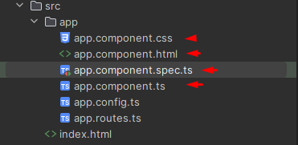

### app.config.ts

Não dizem respeito ao componente criado e sim a própria configuração do nosso projeto Angular.

No tocante ao ``app.config``, ele basicamente diz ao Angular como renderizar os componentes.

Veja abaixo que basicamente ele injeta providers padrão, como "ChangeDetection", para verificar mudanças e renderizar de novo e "providerRoute" para prover as rotas da nossa aplicação de acordo
com o arquivo ``routes``.

```ts
import { ApplicationConfig, provideZoneChangeDetection } from '@angular/core';
import { provideRouter } from '@angular/router';

import { routes } from './app.routes';

export const appConfig: ApplicationConfig = {
  providers: [provideZoneChangeDetection({ eventCoalescing: true }), provideRouter(routes)]
};
```

### app.routes.ts

Já o ``app.routes``, possui uma constante de rotas que terá um array, onde dentro dele eventualmente, será mapeado as rotas da nossa aplicação.

Essas rotas que estarão na array, indicará qual componente deverá ser renderizado de acordo com a página (url) que o usuário acessou.

Novamente, para o navegador, é somente uma página HTML, mas por trás o Angular estará montando páginas de acordo com o que fazemos no routes, veja o exemplo de um mapeamento abaixo:

```ts
import { Routes } from '@angular/router';

export const routes: Routes = [
  {
    path: "home",
    component: HomeComponent
  }
];
```

Dizemos que, no tocante ao path home, ele deve renderizar o HomeComponent.


# Executando o projeto

Podemos executar via terminal, utilizando:

```bash
npm run start
```

Ou só rosar pela própria IDE também. Ficará disponível na porta: 4200.


# Criando um componente

No terminal, digitamos:

```bash
ng generate component components/home
```

Com esse comando, ele irá criar dento do pacote app, uma pasta components e uma outra pasta home com o component "home".  

## Entendendo estrutura base de um componente

Conforme já citamos, um componente é composto por quatro arquivos, vamos abordar um a um.

### CSS

Padrão, arquivo de estilização do componente.

### HTML

Conterá o template, tags HTML, a estrutura em sí. Mesmo que toda a renderização ocorra pelo JavaScript, precisamos usar o HTML.

### Spec

Arquivo para testes unitários. Por padrão o Angular já cria esse arquivo, e no final já faz um teste base, verificando se o componente está sendo criado.

### Typescript

Essa é a classe que vai representar o nosso componente. É dentro dela que deixaremos a lógica do componente, tudo de dinâmico.

```ts
import { Component } from '@angular/core';

@Component({
  selector: 'app-home',
  imports: [],
  templateUrl: './home.component.html',
  styleUrl: './home.component.css'
})
export class HomeComponent {

}
```

Observe que ao fim, ele tem um export com o nome do componente. É ali dentro que fica toda a lógica.

No tocante ao ``@Component`` no início, dele é um "decorator"! Ele basicamente indica para o Angular que essa classe representa um componente.

#### selector

Como a gente se refere ao nosso componente **quando quisermos utilizar ele dentro de OUTRO componente.**

#### standalone

Utilizar componente que são standalone (que não possuem módulos).

#### imports

Tudo que nosso componente for usar de módulos extras do Angular.

#### templateUrl

Referência para o HTML.

#### styleUrl

Referência para o CSS.

# Utilizando o componente

Faremos dois passos.

##### Primeiro

Entrar no componente onde queremos utilizar este componente que criamos e dentro do Array de imports, inserí-lo.

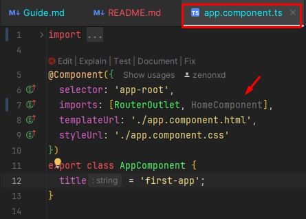

##### Segundo

Agora, vamos para o template do nosso componente principal (app) e chamar nosso componente criado através do seu seletor! Basicamente é só abrir uma tag e digitar o nome
do componente :)

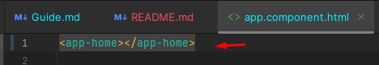

## Adicionando rotas

Lembra que falamos do arquivo ``app.routes``? Este arquivo é responsável por mapear as rotas!

Basicamente falando: path x, utilizará o componente x.

```ts
import {Routes} from '@angular/router';
import {HomeComponent} from "./home.component";

export const routes: Routes = [
  {
    path: '',
    component: HomeComponent
  }
];
```

Usamos como exemplo o path vazio para referenciar o root.

❗Para que esse mapeamento funcione, precisamos deixar a tag de ``router-outlet`` dentro do componente principal (caso seja necessário que as rotas sejam refletidas).

# Estados de um componente

Dentro de componentes, podemos ter informações dinâmicas, um título que pode ser exibido em tela, um boolean que teremos validação/condicional, etc! Isso são **estados**.

Podemos colocar estados no nosso componente através da declaração de atributos da nossa classe, veja:

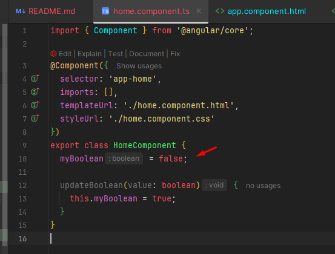

No exemplo acima, nós criamos um estado dentro do nosso componente e inclusive podemos criar métodos para realizar a atualização deles.

Entretanto, precisamos **respeitar os tipos de estado**. Não poderíamos colocar uma String dentro da variável "myBoolean" e tentar alterar dentro do método para true, por exemplo.

Precisamos respeitar a tipagem, caso quissémos fazer um casting para outro tipo, precisaríamos fazer de forma **explícita**.

Agora, como exibir esses dados criados? Veja ⬇️

# Renderizando dados dinâmicos

Pegaremos as informações criadas dentro da classe do nosso componente e renderizá-las no template dele.

```html
<button aria-label="example"></button>
```

No exemplo acima, esse atributo está estático. Se quiséssemos que essa informação viesse da nossa classe, poderíamos criar um **atributo dinâmico**, como fazer isso? Veja!

Normalmente, pensaríamos em utiliza as chaves duplas passando o atributo criado:

```html
<button aria-label={{name}}></button>
```

Entretanto, neste caso é um atributo do tipo "aria", não é possível! O mesmo vale para do tipo "data". Caso fosse um ID, algo mais padrão, seria possível.

Então, como fazer o binding dessas informações? Utilizaremos uma abordagem diferente, ao invés de chaves, utilizaremos colchetes e eles ficarão em volta do **nome do atributo**, veja:

```html
<button [attr.aria-label]="idButton"></button>
```

Usaremos ``attr`` para frisar que estamos acessando o atributo do tipo aria label (não é um atributo default).

O mesmo poderia ser feito com atributos defaults, como ID:

```html
<button [id]="idButton"></button>
```

# Injetando funções para reagirem a eventos (Event Binding)

Nosso button tem o famoso evento que gostamos muito de reagir, o de click! Para fazer isso no Angular, teremos o método declarado na nossa classe, um submit, por exemplo:

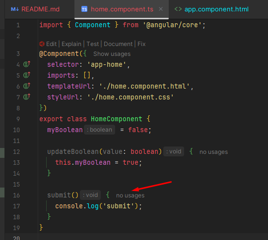

Para ser possível acionar este método através do click desse botão, precisamos mapear este evento.

```html
<button click="submit()"></button>
```

⬆️ Só isso não basta! Por enquanto isso está estática e não irá acionar nosso método da classe, para que funcione, precisamos colocar em volta do evento um parêntese.

```html
<button (click)="submit()"></button>
```

Assim, ele irá reconhecer que o submit é uma função.

## Utilizando parâmetro na função

Podemos, inclusive, passar parâmetros dentro da função no HTML. Obviamente, na classe precisamos também adicionar esse parâmetro a ser recebido, veja:

```html
<button (click)="submit($event)"></button>
```

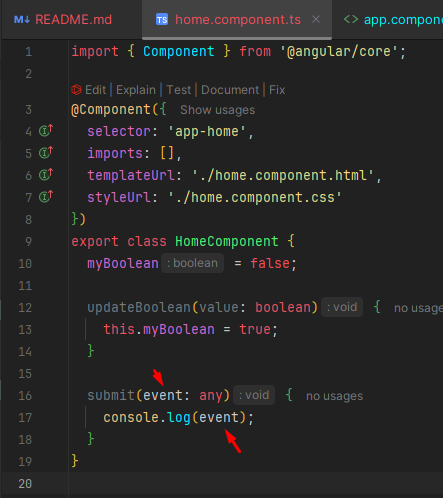

Ao clicar no botão agora, ele mostraria o objeto do evento com todos os seus atributos que podem ser acessados:

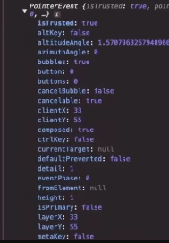

Se hipoteticamente estivéssemos escutando um evento de submit, viria as informações do formulário. 

Portanto, para receber essas informações, precisamos passar esse $event, onde o Angular irá injetar o contexto do evento.

# Loops 

Vamos criar na classe um valor boolean chamado ``deveMostrarTitulo`` que iniciará como false.

Como fazer essa verificação? Dentro do HTML podemos utilizar a sintaxe dos if's, veja:

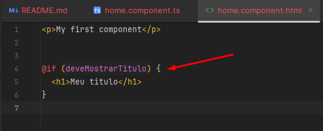

E se quiséssemos uma condição else?

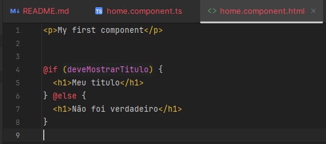

Tem também bloco de else-if.

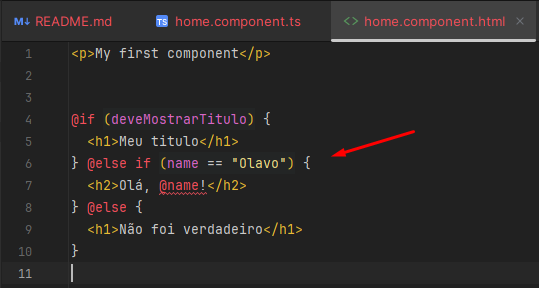

## Versões mais antigas do Angular

Em versões mais antigas do Angular (que você pode estar trabalhando), as condicionais ficavam diferentes, dessa maneira:

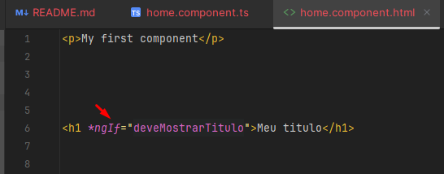

E para isso funcionar, devemos ainda, importar o ``CommonModule`` (que possui as funcionalidades mais comuns do Angular) na classe:

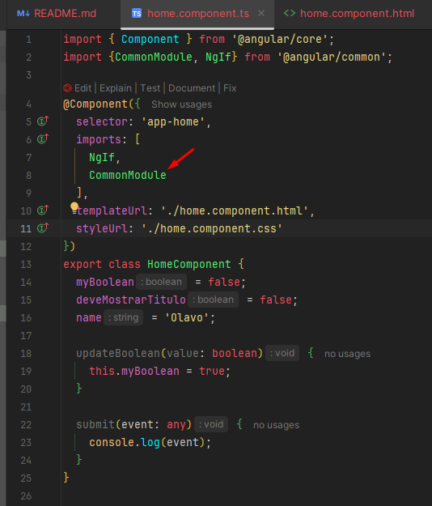

Para usar else, precisava repetir a condição, negando ela:

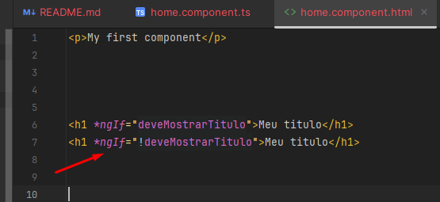

# Condicionais

Parecido com condicionais, mas ao invés de If, usaremos For:

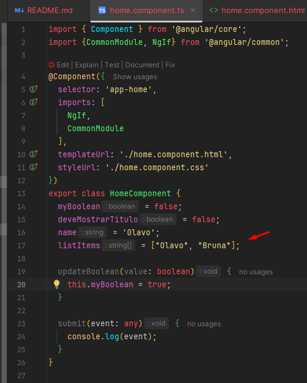

```angular181html
@for (item of listItems; track item) {
  <p>{{item}}</p>
}
```

O ``track`` é uma propriedade do loop que auxilia o Angular a renderizar a nossa lista! Então qualquer eventual alteração que ocorrer, elas serão refletidas corretamente
na UI.

O track mapeia para o Angular, como ele deve identificar cada elemento e como identificar cada um. No nosso caso, nós pedimos para ele identificar o item pelo próprio item
(variável que criamos). Assim, ele pode verificar, por exemplo, que determinado item não é igual a outro.

Mas se tivéssemos uma lista de elementos que contém vários objetos, **poderíamos fazer o track da lista através do ID dos mesmos**.

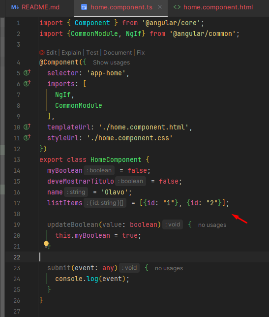

```angular181html
@for (item of listItems; track item.id) {}
```

## Versão antiga

```angular181html
<p *ngFor="let item of listItems">{{item}}</p>
```


# Services (Compartilhando lógica de métodos)

Compartilhando a lógica entre os componentes Angular.

Podemos ter diversos métodos dentro da classe que farão diferentes tipos de lógica, utilizando no nosso template. E se quiséssemos pegar os mesmos métodos criados
no ``HomeComponent`` utilizando em outro componente?

Bom, não poderíamos fazer o acesso direto ao método do homeComponent. Precisaríamos criar uma cópia do método.

Mas poderíamos compartilhar a lógica do método e para isso, criaremos um Service, veja:

No nosso terminal, utilizaremos

```bash
ng generate service services/enviaFormulario
```

Aqui, criaremos um service chamado "serviceEnviaFormulario" dentro da pasta services.

Reaproveitamos o método desejado:

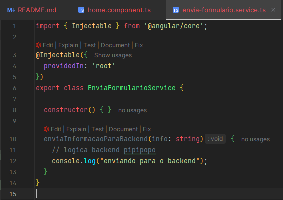

E agora, esse método pode ser reutilizado tanto no HomeComponent quanto no AppComponent:

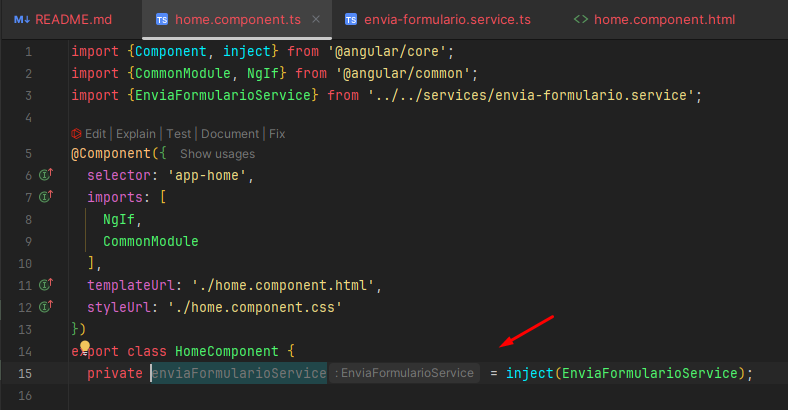

❗Lembre de utilizar o private no atributo.

Repare como fazemos a injeção da classe dentro da outra. Frisando: isso que criamos no HomeComponent é uma INSTÂNCIA do formulario service.

Agora podemos criar a função de submit que irá chamar o enviaFormularioService, passando o parâmetro:

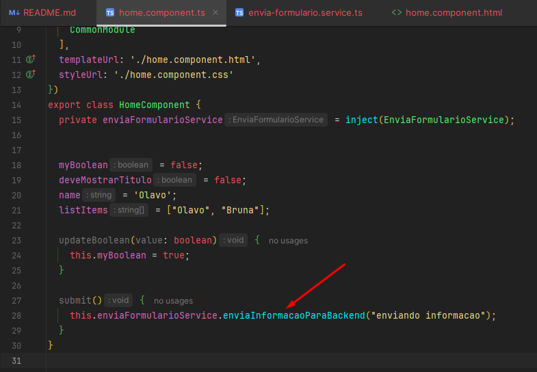

Caso quiséssemos utilizar isso no AppComponent, seria a mesma coisa! Realizar a injeção com private, criar o método e chamar a instância através do ``this``.

## Service um pouco mais a fundo

```ts
import { Injectable } from '@angular/core';

@Injectable({
  providedIn: 'root'
})
export class EnviaFormularioService {

  constructor() { }

  enviaInformacaoParaBackend(info: string) {
    // logica backend pipipopo
    console.log("enviando para o backend");
  }
}
```

Podemos reparar que ele possui uma decoração de ``@Injectable``. Então da mesma forma que nossos componentes possuem o ``@Component``, o service são decorados com esse @.

O provideIn nos diz em quais locais do nosso projeto, esse service pode ser acessado/consumido. Por padrão virá com 'root', ou seja, toda a aplicação.


# Enviando informações de um componente para outro

Passando uma informação que está dentro do AppComponent, para dentro do HomeComponent, por exemplo.

## @Input

No HomeComponent, podemos declarar que ele irá receber um atributo do tipo ``@Input``, chamado "minhaPropsDeFora", seu tipo será ``string``.

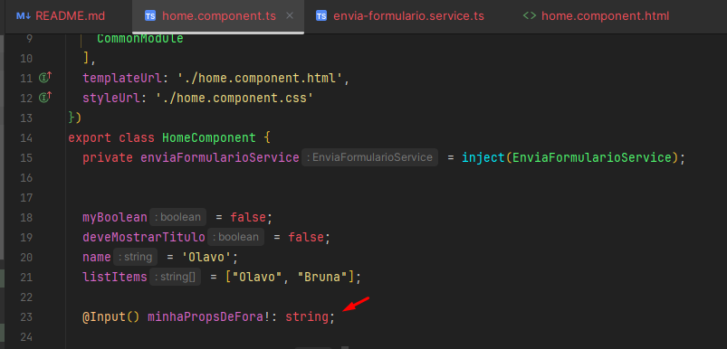

❗Essa "!" é para dizer ao TS que isso será inicializado, para que ele não aponte erro.

Agora no nosso **AppComponent**, quando formos utilizar o **HomeComponent**, passamos na informação:

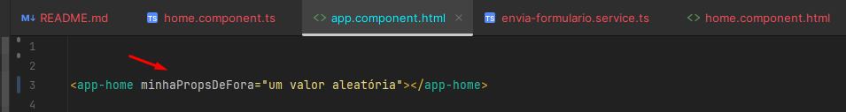

Para mostrar essa informação, vamos para o **HomeComponent**:

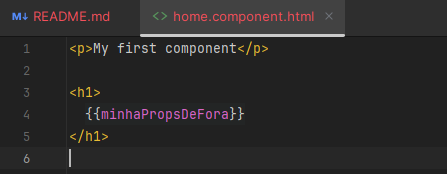

Podemos até realizar alterações, renomeando o nome dessa variável! Por exemplo:

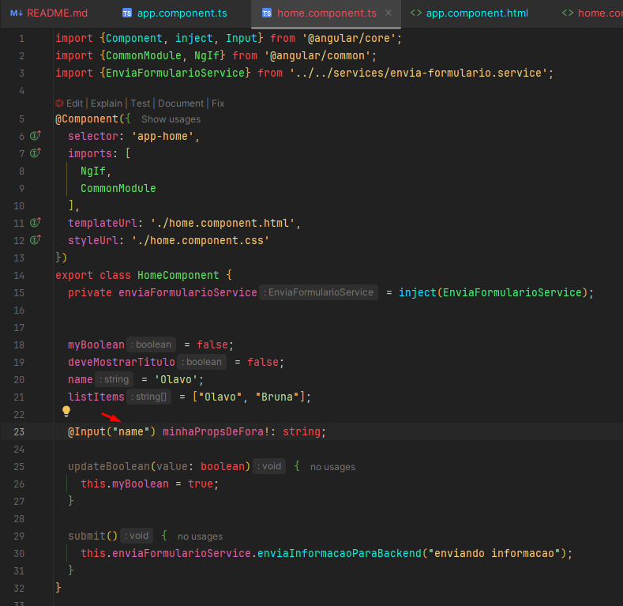

Lá fora será "name", mas dentro do componente será "minhaPropsDeFora".

AppComponent.html ⬇️

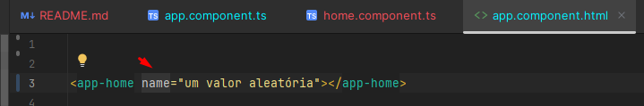

## @Output

O que aconteceu no Input foi: o HomeComponent recebeu informações do AppComponent.

Atualmente o AppComponent está numa posição de "pai" do nosso HomeComponent. 1h07:02
